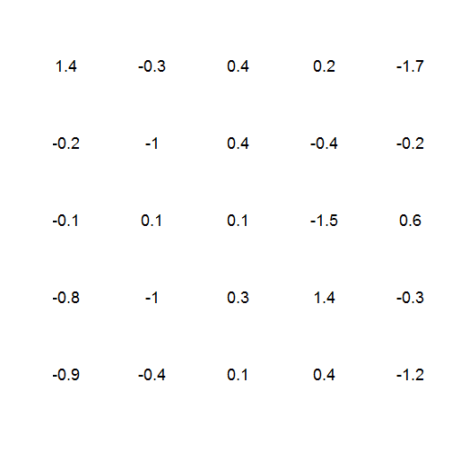
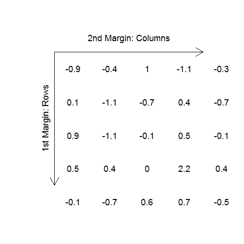
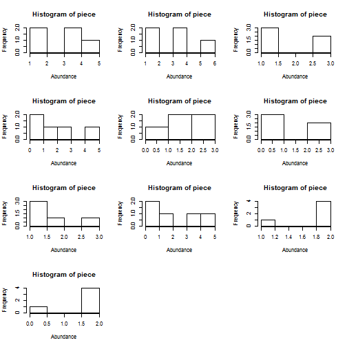

Mastering *apply
========================================================
author: Lionel Hertzog  
date: 22/09/2017
autosize: true


Aim of today's session
========================================================

Learn to master the *apply functions:

- The basics: apply, lapply and sapply
- Going crazy: mapply
- Doing some magic: plyr

apply
========================================================

Definition: apply a **function** to the specified **margins** of an **array**

- What is a function?
- What is a margin?
- What is an array?

apply
========================================================

Definition: apply a **function** to the specified **margins** of an **array**

- What is a function? 


```r
foo <- function(x) {
    out <- x^2
    return(out)
}
```

apply
========================================================

Definition: apply a **function** to the specified **margins** of an **array**

- What is an array? 

An array is a structured collection of data of the **same** type (numeric ...)




apply
========================================================

Definition: apply a **function** to the specified **margins** of an **array**

- What is a margin? 



apply
========================================================

How does it work:

**apply( _some\_array_ , _some\_margins_ , _some\_functions_ )**


```r
# create an array
some_array <- matrix(rnorm(25), nrow = 5)
# determine the margins of the array
dim(some_array)
```

```
[1] 5 5
```

```r
# get the sum for each row
apply(some_array, 1, sum)
```

```
[1] -3.976461 -1.198053 -1.839165 -2.699658  4.229726
```

apply
========================================================

For custom functions we can either explicitely create a function:

```r
foo <- function(x) sum(x^2)
apply(some_array, 1, foo)
```

```
[1]  3.5954829  1.5825104  0.8070861 12.3461965  3.7857348
```

Or we can use anonymous function:

```r
apply(some_array, 1, function(x) sum(x^2))
```

```
[1]  3.5954829  1.5825104  0.8070861 12.3461965  3.7857348
```


apply
========================================================

Time for some exercise, see **apply_exo.Rmd** file, we will use a standard community dataset format:


```
    Sp1 Sp2 Sp3 Sp4 Sp5 Sp6 Sp7 Sp8 Sp9 Sp10
Pl1   1   3   1   1   2   3   1   0  10    2
Pl2   1   0   3   2   2   1   1   0   0    0
Pl3   1   3   3   1   1   3   2   2   1    4
Pl4   1   0   3   1   5   1   0   1   2    1
Pl5   0   0   1   1   2   2   0   3   2    2
```

l(ist)apply
========================================================

Official definition:

lapply returns a **list** of the same length as X, each element of which is the result of **applying some function** to the corresponding element of X.

...

**lapply( some _object , some_function , some_arguments )**

...

some_object is a vector (atomic or list) or an expression object. Other objects (including classed objects) will be **coerced** by base::as.list.

l(ist)apply
========================================================

lapply in action:


```r
(some_list <- list(rep(1, 5), rnorm(5)))
```

```
[[1]]
[1] 1 1 1 1 1

[[2]]
[1]  0.1684733  0.7683894  0.8603258 -0.3874114 -0.2373674
```

```r
lapply(some_list, max)
```

```
[[1]]
[1] 1

[[2]]
[1] 0.8603258
```

l(ist)apply
========================================================

lapply in action:


```r
(some_df <- data.frame(X1 = runif(5), X2 = rnorm(5)))
```

```
           X1         X2
1 0.761959070 -1.4775511
2 0.775471393 -0.3492960
3 0.909089487 -1.1267207
4 0.807222017 -0.2170999
5 0.003858022  0.5277255
```

```r
lapply(some_df, mean)
```

```
$X1
[1] 0.65152

$X2
[1] -0.5285884
```

l(ist)apply
========================================================

Again we can define and use (anonymous) custom functions:


```r
# a useless function
lapply(some_df, function(x) c(x[1] + 1, x[2] + 2))
```

```
$X1
[1] 1.761959 2.775471

$X2
[1] -0.4775511  1.6507040
```

l(ist)apply
========================================================

More interesting say we want to simulate some data based on the observed mean/sd of a dataset:


```r
lapply(some_df, function(x) rnorm(5, mean(x), sd(x)))
```

```
$X1
[1] 0.2225272 0.1204254 1.1167974 1.2638007 0.5356777

$X2
[1] -0.08782976 -1.67848022  0.78619973 -1.18388854 -0.28138969
```

l(ist)apply
========================================================

One can pass **argument** to the function by naming them:


```r
lapply(some_df, paste, collapse = "-")
```

```
$X1
[1] "0.761959069874138-0.77547139278613-0.909089486580342-0.807222017319873-0.00385802169330418"

$X2
[1] "-1.47755112889918--0.349296046762842--1.12672066551953--0.217099934067969-0.527725536979764"
```

l(ist)apply
========================================================

Time for some exercice, this time we'll use the **mtcars** dataset:

```r
data(mtcars)
head(mtcars)
```

```
                   mpg cyl disp  hp drat    wt  qsec vs am gear carb
Mazda RX4         21.0   6  160 110 3.90 2.620 16.46  0  1    4    4
Mazda RX4 Wag     21.0   6  160 110 3.90 2.875 17.02  0  1    4    4
Datsun 710        22.8   4  108  93 3.85 2.320 18.61  1  1    4    1
Hornet 4 Drive    21.4   6  258 110 3.08 3.215 19.44  1  0    3    1
Hornet Sportabout 18.7   8  360 175 3.15 3.440 17.02  0  0    3    2
Valiant           18.1   6  225 105 2.76 3.460 20.22  1  0    3    1
```

s(implify)apply
========================================================

Same as _lapply_ but this time the output will be a **vector** or a **matrix** instead of a **list**


```r
# average value per column
sapply(mtcars, mean)
```

```
       mpg        cyl       disp         hp       drat         wt 
 20.090625   6.187500 230.721875 146.687500   3.596563   3.217250 
      qsec         vs         am       gear       carb 
 17.848750   0.437500   0.406250   3.687500   2.812500 
```

Official doc: sapply is a user-friendly version and wrapper of lapply by default returning a vector, matrix or, if simplify = "array", an array if **appropriate**

s(implify)apply
========================================================

This is useful when one wants to display the information in a nice and compact format:


```r
# write up own summary statistic function
sum_stat <- function(x) {
    quants <- quantile(x, probs = c(0.25, 0.5, 0.75), names = FALSE)
    return(c(Q25 = quants[1], Median = quants[2], Q75 = quants[3]))
}
sapply(mtcars, sum_stat)
```

```
          mpg cyl    disp    hp  drat      wt    qsec vs am gear carb
Q25    15.425   4 120.825  96.5 3.080 2.58125 16.8925  0  0    3    2
Median 19.200   6 196.300 123.0 3.695 3.32500 17.7100  0  0    4    2
Q75    22.800   8 326.000 180.0 3.920 3.61000 18.9000  1  1    4    4
```

s(implify)apply
========================================================

But it will only work the **result** of applying the function to **each element** of the object is of the **same length**


```r
# sapply only coerce response into arrays when all output are of similar
# length
(sapply(mtcars, function(x) x[x > 10]))
```

```
$mpg
 [1] 21.0 21.0 22.8 21.4 18.7 18.1 14.3 24.4 22.8 19.2 17.8 16.4 17.3 15.2
[15] 10.4 10.4 14.7 32.4 30.4 33.9 21.5 15.5 15.2 13.3 19.2 27.3 26.0 30.4
[29] 15.8 19.7 15.0 21.4

$cyl
numeric(0)

$disp
 [1] 160.0 160.0 108.0 258.0 360.0 225.0 360.0 146.7 140.8 167.6 167.6
[12] 275.8 275.8 275.8 472.0 460.0 440.0  78.7  75.7  71.1 120.1 318.0
[23] 304.0 350.0 400.0  79.0 120.3  95.1 351.0 145.0 301.0 121.0

$hp
 [1] 110 110  93 110 175 105 245  62  95 123 123 180 180 180 205 215 230
[18]  66  52  65  97 150 150 245 175  66  91 113 264 175 335 109

$drat
numeric(0)

$wt
numeric(0)

$qsec
 [1] 16.46 17.02 18.61 19.44 17.02 20.22 15.84 20.00 22.90 18.30 18.90
[12] 17.40 17.60 18.00 17.98 17.82 17.42 19.47 18.52 19.90 20.01 16.87
[23] 17.30 15.41 17.05 18.90 16.70 16.90 14.50 15.50 14.60 18.60

$vs
numeric(0)

$am
numeric(0)

$gear
numeric(0)

$carb
numeric(0)
```

s(implify)apply
========================================================

Time for some exercice, we'll use again the **mtcars** dataset.

s(implify)apply
========================================================

sapply for lazy coders:


```r
sapply(1:11, function(data, index) mean(data[, index]), data = mtcars)
```

```
 [1]  20.090625   6.187500 230.721875 146.687500   3.596563   3.217250
 [7]  17.848750   0.437500   0.406250   3.687500   2.812500
```


t(abular)apply
========================================================

Only shortly shown here, very similar to **aggregate**, **by** or the **dplyr-groupy_by-summarise**.

_tapply_ return the results of applying a function to **subsets** of the data as defined by **one or more grouping variables**.


```r
# get the mean miles per gallon for each gear levels:
tapply(mtcars$mpg, mtcars$gear, mean)
```

```
       3        4        5 
16.10667 24.53333 21.38000 
```

m(ulitple)apply
========================================================

Apply a function to each **set** of elements in the **multiple objects** given as inputs (so easy to understand!)

mapply( _some\_function_ , _object1_ , _object2_ , ...)


```r
letters[1:4]
```

```
[1] "a" "b" "c" "d"
```

```r
1:4
```

```
[1] 1 2 3 4
```

Can you guess what will be the ouput of:

```r
mapply(rep, letters[1:4], 1:4)
```

m(ulitple)apply
========================================================

The answer is:

```r
mapply(rep, letters[1:4], 1:4)
```

```
$a
[1] "a"

$b
[1] "b" "b"

$c
[1] "c" "c" "c"

$d
[1] "d" "d" "d" "d"
```

m(ulitple)apply
========================================================

**Important**: mapply does not apply a function to **all** combination of elements, for that purpose one need to use **outer**


```r
outer(1:4, 1:4, "+")
```

```
     [,1] [,2] [,3] [,4]
[1,]    2    3    4    5
[2,]    3    4    5    6
[3,]    4    5    6    7
[4,]    5    6    7    8
```

m(ulitple)apply
========================================================

Usage of mapply, for example when one wants to get the correlation between pairs of variables in two datasets:


```r
# correlation between two sets of variables
mtcars_std <- as.data.frame(sapply(mtcars, function(x) (x - mean(x))/sd(x)))
mapply(cor, x = mtcars, y = mtcars_std)
```

```
 mpg  cyl disp   hp drat   wt qsec   vs   am gear carb 
   1    1    1    1    1    1    1    1    1    1    1 
```

m(ulitple)apply
========================================================

Time for some exercices

plyr
========================================================

The basic idea of **plyr** is to control the **class** of the object outputed after applying a function to some object.

This is done through using letter shortcuts:
- **a** for array
- **d** for data frame
- **l** for list
- **_** for no output


plyr
========================================================

The plyr functions always ends with **ply**, the first letter is the input format, the second letter is the output format.

- **la**ply : I give you a **l**ist as input and I would like an **a**rray as output
- **ad**ply : I give you an array as input and would like a data frame as output, **note** that when using a\*ply you need to specify the **margins** just like with apply
- **ld**ply : ???
- **ll**ply : ???

plyr
========================================================

I have a community matrix and I would like to standardize the rows by the maximum of each row and to have a data frame as output for latter analysis:


```r
adply(comm, 1, function(x) round(x/max(x), 2))
```

```
   X1  Sp1  Sp2  Sp3  Sp4  Sp5  Sp6  Sp7 Sp8  Sp9 Sp10
1 Pl1 0.10 0.30 0.10 0.10 0.20 0.30 0.10 0.0 1.00 0.20
2 Pl2 0.33 0.00 1.00 0.67 0.67 0.33 0.33 0.0 0.00 0.00
3 Pl3 0.25 0.75 0.75 0.25 0.25 0.75 0.50 0.5 0.25 1.00
4 Pl4 0.20 0.00 0.60 0.20 1.00 0.20 0.00 0.2 0.40 0.20
5 Pl5 0.00 0.00 0.33 0.33 0.67 0.67 0.00 1.0 0.67 0.67
```

plyr
========================================================

Now I would like to know the quantiles for each species and get the output in a list:


```r
alply(comm, 2, quantile, probs = c(0.25, 0.5, 0.75))
```

```
$`1`
25% 50% 75% 
  1   1   1 

$`2`
25% 50% 75% 
  0   0   3 

$`3`
25% 50% 75% 
  1   3   3 

$`4`
25% 50% 75% 
  1   1   1 

$`5`
25% 50% 75% 
  2   2   2 

$`6`
25% 50% 75% 
  1   2   3 

$`7`
25% 50% 75% 
  0   1   1 

$`8`
25% 50% 75% 
  0   1   2 

$`9`
25% 50% 75% 
  1   2   2 

$`10`
25% 50% 75% 
  1   2   2 

attr(,"split_type")
[1] "array"
attr(,"split_labels")
     X1
1   Sp1
2   Sp2
3   Sp3
4   Sp4
5   Sp5
6   Sp6
7   Sp7
8   Sp8
9   Sp9
10 Sp10
```

plyr
========================================================

Using "_" as the second letter do not create any output, **but** the side-effects of calling the functions are kept, useful for functions like: plot, print ...


```r
# make an histogram of species abundance
par(mfrow = c(4, 3))
a_ply(comm, 2, hist, xlab = "Abundance")
```



plyr
========================================================

Using "_" as the second letter do not create any output, **but** the side-effects of calling the functions are kept, useful for functions like: plot, print ...


```r
a_ply(comm, 1, function(x) print(summary(x)))
```

```
   Min. 1st Qu.  Median    Mean 3rd Qu.    Max. 
   0.00    1.00    1.50    2.40    2.75   10.00 
   Min. 1st Qu.  Median    Mean 3rd Qu.    Max. 
   0.00    0.00    1.00    1.00    1.75    3.00 
   Min. 1st Qu.  Median    Mean 3rd Qu.    Max. 
    1.0     1.0     2.0     2.1     3.0     4.0 
   Min. 1st Qu.  Median    Mean 3rd Qu.    Max. 
   0.00    1.00    1.00    1.50    1.75    5.00 
   Min. 1st Qu.  Median    Mean 3rd Qu.    Max. 
   0.00    0.25    1.50    1.30    2.00    3.00 
```


