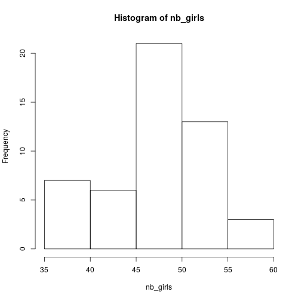
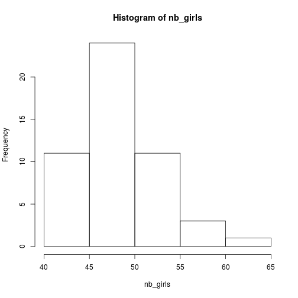
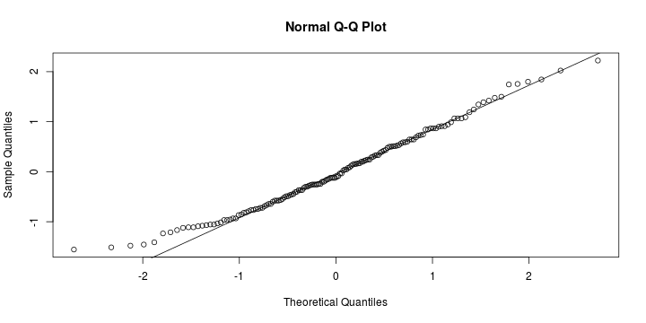

simu_pres
========================================================
author: Lionel Hertzog
date: 23.05.2018
autosize: true

Simulation: what is it?
========================================================

What is simulation for you?


Simulation: what is it?
========================================================

What Wikipedia says: 

"Simulation is the **imitation** of the operation of a real-world process or system. The act of simulating something first requires that a **model** be developed; this model represents the key characteristics, behaviors and functions of the selected physical or abstract system or process. The model **represents** the system itself, whereas the simulation represents the **operation** of the system over time."

Generating stochasticity - the r* functions
========================================================

Generate **r**andom **unif**orm values:


```r
runif(n = 10, min = 0, max = 10)
```

```
 [1] 1.000673 1.865291 2.041160 8.758297 1.270327 5.044570 5.048206
 [8] 2.194853 5.158429 9.878023
```

Generate **r**andom **norm**al values:


```r
rnorm(n = 10, mean = 0, sd = 5)
```

```
 [1] -0.2372572  3.1006836  0.1074503  4.9644669 -2.1504254 -5.6309748
 [7] -0.6847110 10.4923676  0.5919222 -4.4162539
```

Generating stochasticity - the r* functions
========================================================

Generate **r**andom **binom**ial values:


```r
rbinom(n = 10, size = 10, prob = 0.5)
```

```
 [1] 6 7 9 3 3 3 3 4 2 4
```

Generate **r**andom **pois**son values:


```r
rpois(n = 10, lambda = 5)
```

```
 [1] 3 6 3 4 3 8 3 3 4 6
```


Simple simulation example
========================================================

The probability that a baby is a girl is 48.8%, suppose we go to an hospital which recently had 100 births, how many of them can we expect to be girls?


```r
rbinom(n = 1, size = 100, prob = 0.488)
```

```
[1] 44
```

Or:


```r
sum(rbinom(n = 100, size = 1, prob = 0.488))
```

```
[1] 52
```

Exercice
========================================================

As this is a stochastic (random) draw, the best would be to repeat this, say 50 times, to get an idea of the **distribution** of expected number of girls.

Your task:

* Generate 50 simulated values
* Plot an histogram for these values

Solution I
========================================================


```r
nb_sims <- 50
nb_girls <- vector(length=nb_sims)
for(i in 1:nb_sims){
  nb_girls[i] <- rbinom(1,100,0.488)
}
hist(nb_girls)
```


Solution II
=======================================================


```r
nb_sims <- 50
nb_girls <- sapply(1:nb_sims, function(x) rbinom(1,100,0.488))
hist(nb_girls)
```



Solution III
======================================================


```r
nb_girls <- replicate(n = 50,expr = rbinom(1,100,0.488))
hist(nb_girls)
```



Using simulations to test model fitness
====================================================

* Every statistical models make some assumptions about the process that generated the data

* We could use this idea for:
   * A priori exploration of models via fake data simulations
   * A posteriori checks that the model is OK
   
Fake-data simulation - Exercice
===================================================

Assuming a simple linear regression:

$$y \sim N( \alpha + \beta * x, \sigma) $$

Simulate some fake data given:


```r
alpha <- 1
beta <- 2
sigma <- 1
x <- 1:10
```

Then fit a **lm** to this data and check if the model worked good.

Power analysis
===================================================

This could be easily extended to do power analysis

* Generate fake data **N** time with varying sample size
* Fit the model to each fake data set
* Grab the p-value(s) of the parameter(s) of interest
* Compute the proportion of times the parameter(s) was/were significant (this is power)

Power analysis - Exercice
================================================

Conduct a power analysis of the **regression slope** with the following model:

$$ y \sim Poisson(exp(0.5 + 0.25 * x)) $$

With x:

```r
x <- runif(10, -2, 2)
```

And **n** being the sample size varying from 10 to 100 in steps of 10

Power analysis - Results
=================================================


Simulation for checking model fit
===============================================

The idea:

* If your idea of the data-generating process (aka the model) is not too bad then:
* data simulated based ont he model fit should not be too far from the real data
* this can be used, for instance: residuals checks, checking some statistic of the data, over or underdispersion ...

Simulation for checking model fit - Example I
===============================================


```r
library(datasets)
data("swiss")
m <- lm(Fertility ~ Catholic + Education, swiss)
swiss <- cbind(swiss, simulate(m, nsim = 9))
new_resid <- sapply(1:9,function(i){
  m_n <- lm(as.formula(paste0("sim_",i," ~ Education + Catholic")),swiss)
  resid(m_n)
})
par(mfrow=c(3,3))
for(i in 1:9){
  qqnorm(new_resid[,i])
  qqline(new_resid[,i])
}
```


Simulation for checking model fit - Exercice
==============================================

Fit the following model to the __iris__ dataset:

$$Sepal.Length \sim N(\alpha + \beta * Sepal.Width, \sigma)$$

* Simulate 10 new set of Sepal Length from this model,
* re-fit models to these different simulations and 
* check the homogeneity of the variance of these simulated data (residuals vs fitted values)

Simulation for checking model fit - Excercice Bonus
===============================================

Simulate new set of response variables without using the simulate functions

Simulation for checking model fit - Solution
=============================================


```r
library(plyr)
data("iris")
m <- lm(Sepal.Length ~ Sepal.Width, iris)
new_y <- simulate(m,9)
modmat <- model.matrix(terms(m),iris)
par(mfrow=c(3,3))
a_ply(new_y,2,function(y){
  new_m <- lm.fit(modmat,y[,1])
  plot(fitted(new_m),resid(new_m))
  abline(h=0,lty=2,col="red")
})
```




