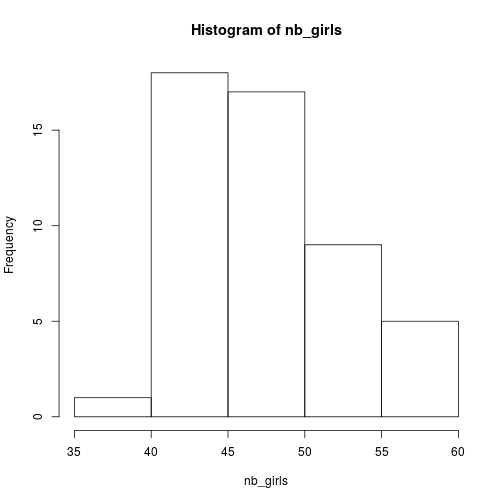
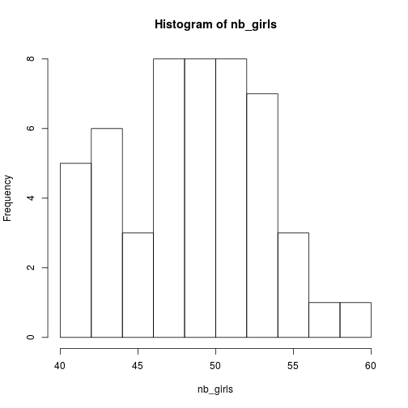
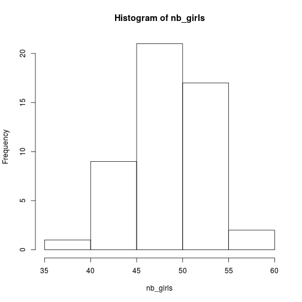
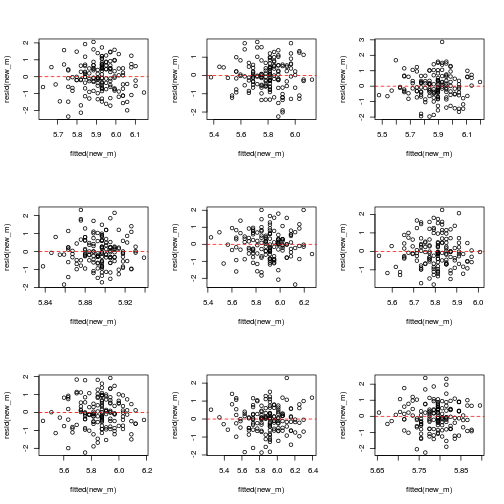
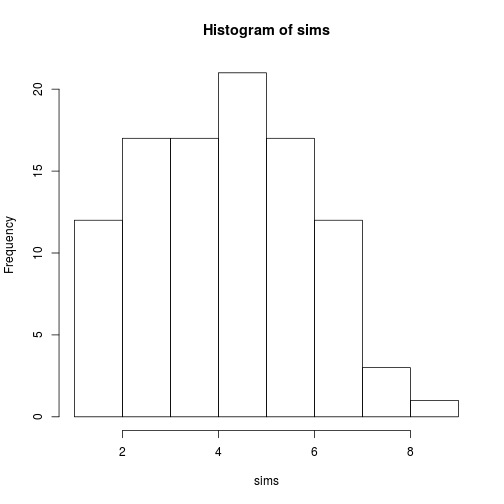
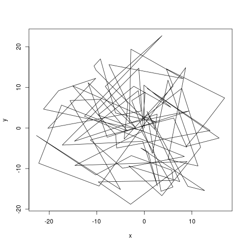

simu_solutions
========================================================
author: Lionel H.
date: 
width: 1920
height: 1080

Exercice
========================================================

As this is a stochastic (random) draw, the best would be to repeat this, say 50 times, to get an idea of the **distribution** of expected number of girls.

Your task:

* Generate 50 simulated values
* Plot an histogram for these values

Solution I
========================================================


```r
nb_sims <- 50
nb_girls <- vector(length=nb_sims)
for(i in 1:nb_sims){
  nb_girls[i] <- rbinom(1,100,0.488)
}
hist(nb_girls)
```



Solution II
=======================================================


```r
nb_girls <-  rbinom(n=50,size=100,prob=0.488)
hist(nb_girls)
```



Solution III
======================================================


```r
nb_girls <- replicate(n = 50,expr = rbinom(1,100,0.488))
hist(nb_girls)
```



Fake-data simulation - Exercice
===================================================

Assuming a simple linear regression:

$$y \sim N( \alpha + \beta * x, \sigma) $$

Simulate some fake data given:


```r
n <- 30
alpha <- 1
beta <- 2
sigma <- 1
x <- 1:30
```

* Then fit a **lm** to this data and check if the model worked good.
* Try out different sample size, what happens?
* Put this into a function


Fake-data simulation - Solution
=======================================================


```r
y <- rnorm(n, alpha + beta * x, sigma)
lm(y ~ x)
```

```

Call:
lm(formula = y ~ x)

Coefficients:
(Intercept)            x  
     0.7417       2.0243  
```

Power analysis - Exercice
================================================

Conduct a power analysis of the **regression slope** with the following model:

$$ y \sim Poisson(exp(0.5 + 0.25 * x)) $$

With x:

```r
x <- runif(10, -2, 2)
```

The sample size varying from 10 to 100 in steps of 10.

Hint: Think function!

Power analysis - Results
=================================================


```r
n <- seq(10,100,10)
pow_fun <- function(n){
  x <- runif(n,-2,2)
  y <- rpois(n,lambda=exp(0.5 + 0.25 * x))
  m <- glm(y~x,family = "poisson")
  return(summary(m)$coefficients[2,4])
}
n_rep <- 100
pow_slp <- sapply(n,function(n) sum(replicate(n_rep,pow_fun(n)) < 0.05) / n_rep)
{plot(n,pow_slp,type="l",cex=2)
abline(h=0.8,lty=2,lwd=2)}
```


Simulation for checking model fit - Exercice
==============================================

Fit the following model to the __iris__ dataset:

$$Sepal.Length \sim N(\alpha + \beta * Sepal.Width, \sigma)$$

* Simulate 10 new set of Sepal Length from this model,
* re-fit models to these different simulations and 
* check the homogeneity of the variance of these simulated data (residuals vs fitted values)
* Bonus: simulate new set of response variables without using the simulate functions
* Bonus: load the dataset "test_data.csv" into R, fit the following model: 
      glmer(observedResponse ~ Environment1 + (1|group) , family = "poisson", data = ...), try to find out if the data are over or underdispersed


Simulation for checking model fit - Solution
=============================================


```r
library(plyr)
data("iris")
m <- lm(Sepal.Length ~ Sepal.Width, iris)
new_y <- simulate(m,9)
modmat <- model.matrix(terms(m),iris)
par(mfrow=c(3,3))
a_ply(new_y,2,function(y){
  new_m <- lm.fit(modmat,y[,1])
  plot(fitted(new_m),resid(new_m))
  abline(h=0,lty=2,col="red")
})
```



Simulating ecological processes - Exercice
======================================

To make it more interesting, assume that each attack is consuming energy and so after each failed attack the success of the subsequent attack is declined by 10%

* Simulate 10 attacks taking the starvation into account
* Bonus: put this in a function to be able to vary the number of attacks, the baseline sucess rate but also the decline in attack success
* Bonus: simulate several individuals and plot the distribution of total number of subdued preys

Simulating ecological processes - Solution
=====================================


```r
attack <- function(n = 10, base_prob = 0.5, decline = 0.1){
  att <- rep(NA, n)
  att[1] <- rbinom(n = 1, size = 1, prob = base_prob)
  current_prob <- base_prob
  for(i in 2:n){
    if(att[(i-1)] == 1){
      current_prob <- base_prob
      att[i] <- rbinom(n = 1, size = 1, prob = current_prob)
    }
    if(att[(i-1)] == 0){
      current_prob <- current_prob - (current_prob * decline)
      att[i] <- rbinom(n = 1,size = 1,prob = current_prob)
    }
  }
  return(att)
}

#simulate 100 individuals and plot
sims <- replicate(n = 100,expr = sum(attack()))
hist(sims)
```



Simulating ecological processes - Movement
==============================


```r
random_walk <- function(n = 10){
  x<-0
  y<-0
for(i in 2:n){
  angle <- runif(n,0,2*pi)
  step <- rnorm(n,10,2)
  x <- c(x, x[(i-1)] + step * cos(angle))
  y <- c(y, y[(i-1)] + step * sin(angle))
}
return(data.frame(x=x,y=y))
}
rr <- random_walk()
plot(y~x,rr,type="l")  
```




